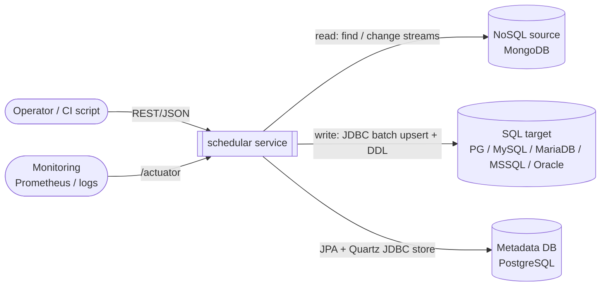
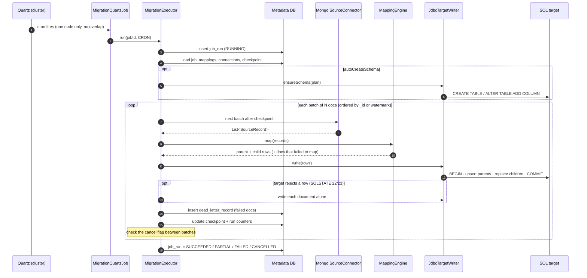
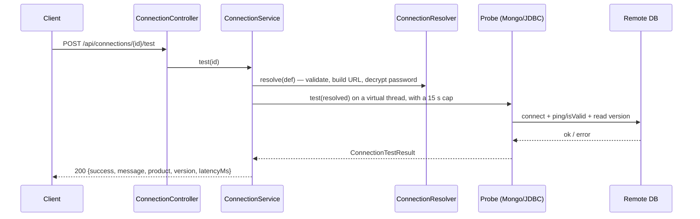
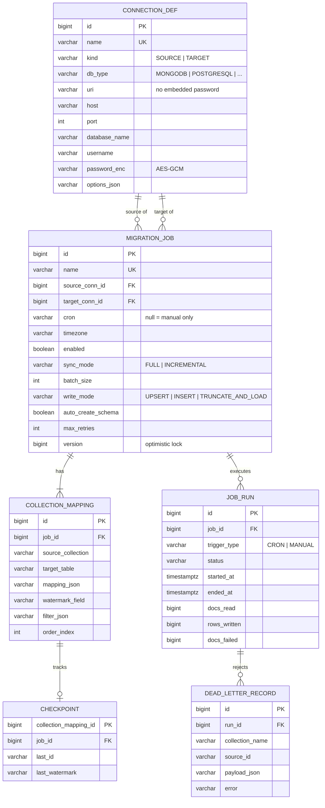
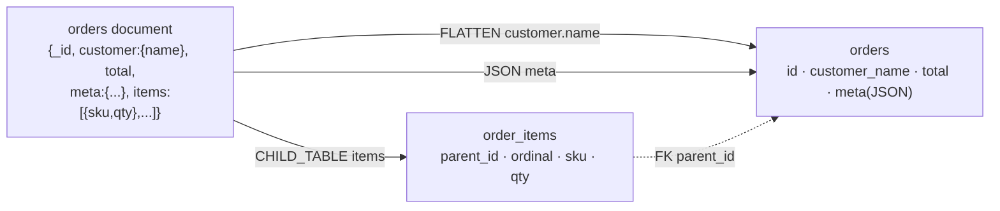
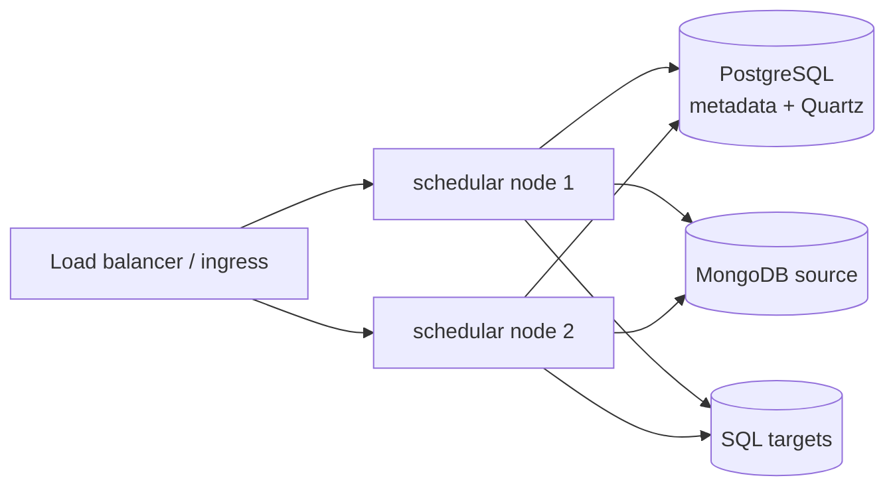

# High-Level Design: NoSQL → SQL Migration Scheduler

| | |
|---|---|
| **System** | `schedular` |
| **Version** | 1.2 (2026-10-04) |
| **Stack** | Java 21, Spring Boot 4.1.1, Quartz, Hibernate/JPA, Flyway |
| **Related** | [PLAN.md](PLAN.md) has the implementation plan and delivery phases |
| **Status** | Phases 1–3 are implemented: the connection API, the migration engine (MongoDB → PostgreSQL), and Quartz scheduling with the job and run API. Sections marked *(planned)* describe later phases. |

---

## 1. Purpose and scope

### 1.1 Problem
Operational data often lives in NoSQL stores (MongoDB), but reporting, analytics and integrations need it in
relational databases. Hand-written export scripts don't handle these needs well:
- running on a schedule
- copying only what changed
- restarting safely after a failure
- converting nested documents and arrays into tables

### 1.2 Goal
A self-hosted service that **reads data from a NoSQL source and writes it into a SQL target**. A run can be started on a
cron schedule or on demand. Each job is set up through a REST API, and runs are:
- **idempotent:** running again never duplicates rows
- **resumable:** a failed run picks up where it stopped
- **observable:** each run's status, counts and failures are recorded

### 1.3 In scope
- Sources: **MongoDB** (v1). The design is pluggable for Cassandra, DynamoDB and others.
- Targets: **PostgreSQL, MySQL, MariaDB, SQL Server, Oracle**.
- Full and incremental sync, configurable mapping of nested data, cron scheduling, run history, dead-letter
  storage for documents that fail.

### 1.4 Out of scope for v1
- SQL → NoSQL migration, or migrating SQL → SQL
- Bidirectional sync and conflict resolution
- Propagating deletes (comes with CDC in Phase 5)
- Complex transformations (joins across collections, aggregations, scripting)
- A web UI. v1 is API-only; a UI is a Phase 5 option.

---

## 2. Requirements

### 2.1 Functional
| ID | Requirement |
|---|---|
| F1 | Register, test and manage source and target **connections** |
| F2 | Define **migration jobs**: a source, a target, one or more collection → table mappings, a schedule and options |
| F3 | Map documents to rows: **flatten** nested objects, store them as **JSON** columns, or explode arrays into **child tables** |
| F4 | **Suggest a mapping** automatically by sampling source documents |
| F5 | Optionally **create or extend target tables** automatically. It only adds; it never drops. |
| F6 | **FULL** sync (the whole collection) and **INCREMENTAL** sync (driven by a watermark field) |
| F7 | Run on a **cron schedule** (per-job timezone) or **manually**. Pause, resume or cancel a run. |
| F8 | Record **run history** (status, counts, errors) and **dead letters** (documents that failed) |
| F9 | **Reset a checkpoint** so the next run does a full reload |

### 2.2 Non-functional
| Attribute | Target |
|---|---|
| **Correctness** | At-least-once delivery, and each write is idempotent (an upsert by primary key), so the result is effectively exactly-once. |
| **Resumability** | A crash loses at most one in-flight batch. The next run resumes from the last committed checkpoint. |
| **Throughput** | About 5–20k docs/s per job on commodity hardware (batch size 1000), limited mainly by how fast the target can write. |
| **Memory** | Bounded by batch size. Collections are streamed, never loaded whole. |
| **Availability** | Several instances can run in a Quartz cluster. A job never runs twice at the same time. |
| **Security** | Secrets are encrypted at rest (AES-256-GCM) and never returned by the API. Identifiers are always quoted. |
| **Observability** | Health and metrics via Actuator/Micrometer. Logs carry the run id. |
| **Portability** | The metadata DB is PostgreSQL in production, with H2 for local use and tests. |

---

## 3. System context



| Actor / system | Interaction |
|---|---|
| Operator / automation | Manages connections and jobs, starts runs and reads their results through the REST API |
| NoSQL source | Read-only. The service never writes to it. |
| SQL target | Receives upserts. DDL runs there only when `autoCreateSchema` is on. |
| Metadata DB | Stores configuration, checkpoints, run history and the Quartz scheduler state |
| Monitoring | Scrapes health and metrics |

---

## 4. Architecture

### 4.1 Architectural style
The service is a **modular monolith**: one Spring Boot deployable with clear internal layers. A migration run is a
**batch pipeline** (*read → transform → write → checkpoint*). Database-specific behavior sits behind two plug-in
interfaces (an SPI for each side):
- `SourceConnector`, one per NoSQL store
- `SqlDialect`, one per SQL database

Adding a database means adding one implementation. The pipeline itself doesn't change.

### 4.2 Component view

```mermaid
flowchart TB
    subgraph API["API layer (api/)"]
        CC[ConnectionController]
        JC[JobController]
        RC[RunController]
        EH[GlobalExceptionHandler<br/>RFC 9457 problem JSON]
    end

    subgraph SVC["Service layer (service/)"]
        CS[ConnectionService]
        JS[JobService]
        RS[RunService]
        SC[SecretCipher<br/>AES-256-GCM]
        CR[ConnectionResolver<br/>validate + build URL]
        PR[ConnectionProbes<br/>Mongo / JDBC]
    end

    subgraph SCH["Scheduling (scheduler/)"]
        SS[SchedulerService]
        QJ[MigrationQuartzJob<br/>@DisallowConcurrentExecution]
    end

    subgraph ENG["Migration engine (engine/)"]
        EX[MigrationExecutor<br/>+ StaleRunCleaner]
        SRC[SourceConnector SPI<br/>MongoSourceConnector]
        MAP[MappingCompiler · MappingEngine<br/>TypeCoercer]
        TW[JdbcTargetWriter<br/>SchemaManager]
        DL[SqlDialect SPI<br/>PG ✅ · MySQL · MSSQL · Oracle]
        DSR[Per-run HikariCP pool]
    end

    subgraph PER["Persistence (domain/ + repository/)"]
        REPO[(JPA repositories)]
    end

    CC --> CS
    JC --> JS
    RC --> RS
    CS --> CR --> SC
    CS --> PR
    JS --> SS
    SS --> QJ --> EX
    RS --> EX
    EX --> SRC
    EX --> MAP
    EX --> TW --> DL
    EX --> DSR
    EX --> CR
    CS & JS & RS & EX --> REPO
```

### 4.3 Component responsibilities

| Component | Responsibility | Status |
|---|---|---|
| `ConnectionController` | CRUD, test (saved or unsaved settings), list collections/tables | ✅ built |
| `ConnectionService` | Business rules: unique names, block deleting or retyping a connection a job uses, run probes under a 15 s timeout on virtual threads | ✅ built |
| `ConnectionResolver` | Validate settings, reject URIs with an embedded password, build the URL for each DB type, decrypt the password into a `ResolvedConnection` | ✅ built |
| `SecretCipher` | AES-256-GCM encrypt/decrypt with a random IV. Format: `v1:base64(iv‖ct‖tag)` | ✅ built |
| `MongoConnectionProbe` / `JdbcConnectionProbe` | Check connectivity and read product/version; list collections or tables | ✅ built |
| `GlobalExceptionHandler` | Map service errors to status codes: 400, 404, 409, 502 | ✅ built |
| `JobService` / `JobController` | Job CRUD with full validation (connections, cron, timezone, mapping, filter, sync/write mode, one writer per table), run now, pause/resume, reset checkpoint. An update keeps unchanged mappings (and their checkpoints). | ✅ built |
| `SchedulerService` | Keep Quartz triggers in step with the jobs table (create, replace, remove) and reconcile at startup | ✅ built |
| `MigrationQuartzJob` | The Quartz entry point (`@DisallowConcurrentExecution`). Skips a firing if the job is already running, and removes the schedule of a deleted job. | ✅ built |
| `RunService` / `RunController` | Run history and details, cancel, dead letters (paged) | ✅ built |
| `MigrationExecutor` | Runs the batch loop: transactions, checkpoints, retries, row-by-row fallback, dead letters, counters, the final status. Rejects a second concurrent run of the same job. | ✅ built |
| `StaleRunCleaner` | At startup, marks the runs this instance left `RUNNING` (matched by `node_id`) as `FAILED`, keeping their checkpoints | ✅ built |
| `SourceConnector` (Mongo) | Read batches from one cursor, in a stable order, applying the filter and the checkpoint (id or watermark) | ✅ built |
| `MappingCompiler` | Parse and validate the mapping JSON (unknown properties, identifiers, duplicate columns) into a `MappingPlan` | ✅ built |
| `MappingEngine` / `TypeCoercer` | Turn a document into a parent row plus child-table rows; convert BSON values to each column type | ✅ built |
| `SchemaInferrer` | Sample N documents and propose a valid mapping, including a watermark field | ✅ built |
| `SchemaManager` | Create missing tables and columns (it only adds, never drops); check that an existing table has a key to upsert on | ✅ built |
| `JdbcTargetWriter` | Batch upserts per table; replace child rows; truncate for `TRUNCATE_AND_LOAD` | ✅ built |
| `SqlDialect` | Quoting, type mapping, upsert syntax, DDL, binding, and classifying errors (transient / data / fatal) per DB | ✅ PostgreSQL; others Phase 4 |

---

## 5. Key flows

### 5.1 Scheduled migration run

A manual run (`POST /api/jobs/{id}/run`) follows the same steps from step 3 on. It runs on a background thread, and
the API returns the new `RUNNING` run immediately (`202`, with a `Location` to poll).



**Ordering guarantee:** the target transaction for a batch commits **before** its checkpoint is saved. If the process
dies between the two, the next run re-reads that batch and upserts it again. That writes nothing new, so no data is
lost and nothing is duplicated.

### 5.2 Connection test (built)



---

## 6. Data design

### 6.1 Metadata model



- Flyway owns the schema (`V1__init.sql`). Hibernate only **validates** it.
- Deleting a job cascades to its mappings, checkpoints, runs and dead letters. Connections are protected by the
  foreign keys from jobs (`RESTRICT`).
- `V2` widens the checkpoint columns to 2000 characters. Checkpoints are stored as type-preserving MongoDB Extended
  JSON (for example `{"v": {"$oid": "…"}}`), so an ObjectId resumes as an ObjectId, not a string.
- `V3` adds Quartz's `QRTZ_*` tables (its PostgreSQL script, which also runs on H2) and `job_run.node_id`.

### 6.2 Document → relational mapping

Each `collection_mapping.mapping_json` declares how fields map. For example:

```json
{
  "primaryKey": {"source": "_id", "column": "id", "type": "STRING"},
  "fields": [
    {"path": "customer.name", "column": "customer_name", "type": "STRING"},
    {"path": "total",         "column": "total",         "type": "DECIMAL"},
    {"path": "meta",  "strategy": "JSON",        "column": "meta"},
    {"path": "items", "strategy": "CHILD_TABLE", "childTable": "order_items",
     "fields": [{"path": "sku", "column": "sku", "type": "STRING"},
                {"path": "qty", "column": "qty", "type": "INT"}]}
  ],
  "unmappedFields": "IGNORE"
}
```

Every property except a field's `path` is optional. The defaults are:
- primary key: `_id → id STRING`
- column name: the path with dots replaced by underscores
- type: `STRING(255)`
- strategy: `FLATTEN`

`unmappedFields: "JSON_OVERFLOW_COLUMN"` keeps any top-level fields that aren't mapped in an `_extra` JSON column.
For an array of scalars (for example tags), leave out the child `fields`: each element is stored in a `value` column.
Unknown properties are rejected, so a typo such as `"paht"` fails the run with a clear message instead of being
silently ignored.



| Strategy | Result | When to use |
|---|---|---|
| `FLATTEN` | `a.b.c` becomes column `a_b_c` | Small, stable nested objects |
| `JSON` | One JSON column (`jsonb` on PG, `JSON` on MySQL, `NVARCHAR(MAX)` on MSSQL, `CLOB` on Oracle) | Variable or schemaless sub-documents |
| `CHILD_TABLE` | One row per array element, keyed by (`parent_id`, `ordinal`) | Arrays you need to query or join |

**Type mapping (logical type → SQL type):**

| BSON | Logical | PostgreSQL | MySQL/MariaDB | SQL Server | Oracle |
|---|---|---|---|---|---|
| ObjectId / string | STRING / TEXT | `varchar(n)`/`text` | `varchar(n)`/`text` | `nvarchar(n)` | `varchar2(n)` |
| int32 / int64 | INT / LONG | `integer`/`bigint` | `int`/`bigint` | `int`/`bigint` | `number(10)`/`number(19)` |
| Decimal128 | DECIMAL | `numeric` (exact, unbounded) | `decimal(38,10)` | `decimal(38,10)` | `number` |
| double | DOUBLE | `double precision` | `double` | `float` | `binary_double` |
| boolean | BOOLEAN | `boolean` | `tinyint(1)` | `bit` | `number(1)` |
| Date | TIMESTAMP | `timestamptz` | `datetime(6)` | `datetime2` | `timestamp with time zone` |
| object / array | JSON | `jsonb` | `json` | `nvarchar(max)` | `clob` |
| binary | BINARY | `bytea` | `longblob` | `varbinary(max)` | `blob` |

Values are converted leniently where that is lossless: `"42"` becomes INT 42, `"yes"` becomes BOOLEAN true, ISO
strings and epoch milliseconds become TIMESTAMP. A conversion that would lose information is not done; instead the
document is dead-lettered. Examples are `2.5` into INT, a value outside the INT range, and a string longer than the
STRING length.

---

## 7. Sync semantics

| Mode | Read query | Checkpoint | Re-run behavior |
|---|---|---|---|
| **FULL** ✅ | `find(filter ∧ _id > lastId).sort(_id)` | `last_id` after each batch, cleared on success | Restarts mid-collection after a failure. A completed run starts from the beginning next time. |
| **INCREMENTAL** ✅ | `find(filter ∧ watermark ≥ lastWatermark).sort(watermark, _id)` | `last_watermark` = the highest value written | Each run picks up only new or updated docs |
| **CDC** *(Phase 5)* | Mongo change stream | Resume token | Near real time; propagates deletes |

| Write mode | Behavior |
|---|---|
| `UPSERT` (default) | Insert, or update by primary key. Idempotent. |
| `INSERT` | Plain insert. Fastest, but not idempotent. Use only for append-only data. |
| `TRUNCATE_AND_LOAD` | Truncate the target tables at the start of a fresh full load, then upsert (so a resumed load stays idempotent). Allowed with FULL mode only. |

In every mode except `INSERT`, each parent's child-table rows are deleted and re-inserted in the same transaction.
That keeps child tables in step when array elements are removed at the source.

**Upsert per dialect:**

| Dialect | Upsert statement |
|---|---|
| PostgreSQL | `INSERT … ON CONFLICT (pk) DO UPDATE` |
| MySQL / MariaDB | `INSERT … ON DUPLICATE KEY UPDATE` |
| SQL Server / Oracle | `MERGE` |

**Watermark caveats:**
- **Boundary documents are re-read on purpose.** The engine reads `≥ lastWatermark`, not `>`. Documents that share
  the last saved watermark, including ones written while the previous run was in progress, are therefore never
  missed. The re-read rows are harmless because writes are upserts.
- **Documents without the watermark field are only picked up by the first run.** After that, the `≥` filter
  excludes them.
- **Possible future option:** a configurable safety window (`≥ lastWatermark − window`), for sources whose clocks or
  writers are skewed.

---

## 8. Scheduling and concurrency

- **Quartz with a JDBC JobStore, clustered.** Triggers live in the metadata DB, so a schedule survives restarts. When
  several instances run, exactly one claims each firing.
- **The jobs table is the source of truth.** `SchedulerService` derives the Quartz state from it: an enabled job
  with a cron has one `CronTrigger` (`cron-{id}`, in the job's timezone), and any other job has none. Changes are
  written in the same transaction as the job edit. At startup, a reconcile adds missing or changed triggers and
  removes orphaned ones.
- **No overlap:** `@DisallowConcurrentExecution` stops a job running twice at once across the cluster. The executor
  also claims each job before a run, in memory and by checking the `RUNNING` run row. As a result:
  - a manual run while one is in progress is rejected with `409`;
  - a cron firing that finds the job running is skipped and logged;
  - editing, deleting or resetting a running job is rejected with `409`.
- **Pause** removes the trigger. A run already in progress continues, and manual runs are still allowed. **Resume**
  recreates the trigger.
- **Misfires** (for example, the app was down at fire time) use `MISFIRE_INSTRUCTION_DO_NOTHING`, so missed slots are
  not replayed in a burst.
- **Cancel** only sets a flag. The executor checks it between batches and every 100 ms during a retry wait. It never
  interrupts the thread, because an interrupt during JDBC I/O closes the connection mid-statement. The run ends
  `CANCELLED` and keeps its checkpoint, so the next run continues from there. Cancel goes to the instance running
  the run (`nodeId` on the run); another instance answers `409`.
- **Shutdown:** in-progress runs are cancelled and given up to 30 s to stop cleanly. A run that doesn't stop in time is
  closed as `FAILED` by `StaleRunCleaner` when that instance next starts.
- **Thread pool:** the Quartz pool size (default 5) caps how many scheduled jobs run at once on each node. Manual runs
  use separate virtual threads.
- **Delegate:** `QuartzConfig` picks Quartz's JDBC delegate from the metadata DB in use (`PostgreSQLDelegate` for
  PostgreSQL's `bytea`, the standard one for H2). An idle scheduler checks for new triggers every 5 s.

---

## 9. Failure handling

| Failure | Handling | Run outcome |
|---|---|---|
| A single document can't be mapped (bad type, oversized value) | Written to `dead_letter_record`; the batch continues | `PARTIAL` if any doc failed |
| The target rejects a row (SQLSTATE class 22 data error or 23 constraint violation, e.g. a value out of range or invalid JSON) | The batch is rolled back and the documents are written one at a time. Only the rejected ones go to `dead_letter_record`. | `PARTIAL` |
| Transient error (network drop, deadlock, failover) | Retry the batch with exponential backoff (1s, 2s, 4s… capped at 30s, up to `max_retries`). The transaction is rolled back first. | Continues |
| Retries exhausted / fatal error (auth failure, target DDL error) | Stop the run. The checkpoint stays at the last good batch. | `FAILED` with `error_message` |
| Process crash / node loss | The in-flight transaction rolls back. Quartz recovery and the next fire resume from the checkpoint. A stale `RUNNING` row is closed at startup. | `FAILED` (orphaned) → the next run resumes |
| Source/target unreachable when testing | Reported in the body (`success:false`), or as `502` when listing objects | n/a |

---

## 10. Security design

| Concern | Control |
|---|---|
| Secrets at rest | Connection passwords are encrypted with AES-256-GCM using a random 96-bit IV for each value. The key comes from `SCHEDULAR_SECRET_KEY` and is never stored in the DB. ✅ |
| Secrets in transit (API) | The password is write-only. Responses show only `passwordSet: true/false`. `ResolvedConnection.toString()` leaves it out, so it never appears in logs. ✅ |
| Plain-text secrets in URIs | URIs that contain `user:pass@` or `password=` are rejected with `400`. ✅ |
| Fail-safe startup | The app refuses to start without a valid 32-byte key. ✅ |
| SQL injection via mapping names | Table and column names must match `[A-Za-z_][A-Za-z0-9_]{0,62}` (optionally `schema.table`) and the dialect always quotes them. Values are always bound as parameters. ✅ |
| API authentication | HTTP basic auth or OAuth2 resource server through Spring Security. *(Phase 4)* |
| Least privilege | Source credentials need only read access. Target credentials need DML, plus DDL only if `autoCreateSchema` is on. |
| Key rotation | *(Future)* Support several key versions (`v2:` prefix) and add a re-encrypt task. |

---

## 11. Scalability and performance

- **Batching:** reads use one Mongo cursor per collection with `batchSize = job.batchSize`. Writes use JDBC
  `addBatch/executeBatch` (in chunks of 500 rows) in one transaction per batch. Each dialect turns on its driver's
  batch rewriting: `reWriteBatchedInserts=true` for PostgreSQL ✅, and `rewriteBatchedStatements=true` for MySQL
  *(Phase 4)*.
- **Memory:** at most one batch per running job is held in memory. Neither the read side nor the write side buffers
  more than that.
- **Connections:** each run opens its own small HikariCP pool (2 connections) for the target and its own Mongo
  client, and closes both at the end. Because nothing is shared between runs, editing or deleting a connection never
  disturbs a run in progress.
- **Parallelism:** different jobs run in parallel up to the Quartz pool size (per node). Adding nodes to the Quartz
  cluster spreads jobs across them. A single job is sequential, to keep the checkpoint ordering correct.
- **Future option:** split large FULL loads into `_id` ranges and run them in parallel, each with its own checkpoint.

---

## 12. Observability

| Signal | Detail |
|---|---|
| Health | `/actuator/health` (liveness/readiness; includes the metadata DB) ✅ |
| Metrics | `/actuator/metrics` ✅. Per-job counters and timers are planned: `migration.docs.read`, `migration.rows.written`, `migration.docs.failed`, `migration.batch.duration`, `migration.run.duration{status}` |
| Run history | `GET /api/jobs/{id}/runs`, `GET /api/runs/{runId}`, `GET /api/runs/{runId}/dead-letters` ✅ |
| Logging | SLF4J/Logback. `runId` and `jobId` go in the MDC during a run. Passwords never appear in logs. |
| Alerts *(Phase 5)* | A webhook or email on `FAILED`, or when the dead-letter count passes a threshold |

---

## 13. Deployment view



| Environment | Setup |
|---|---|
| Local, no Docker | `spring-boot:run` with the `local` profile, using an embedded H2 metadata DB in `./data` ✅ |
| Local, Docker | `docker compose up`: PostgreSQL (metadata plus a `warehouse` target), MongoDB seeded with `shop` data, MySQL ✅ |
| Production | A stateless container image (`spring-boot:build-image`) with 1–N replicas, a managed PostgreSQL for metadata, and the secret key injected from a vault or K8s secret |

**Configuration** (12-factor style: everything comes from the environment):
- `SCHEDULAR_SECRET_KEY`
- `SCHEDULAR_DB_URL`, `SCHEDULAR_DB_USER`, `SCHEDULAR_DB_PASSWORD`
- `schedular.connection-test-timeout`

---

## 14. API surface

| Resource | Endpoints | Status |
|---|---|---|
| Connections | `GET/POST /api/connections`, `GET/PUT/DELETE /api/connections/{id}`, `POST /api/connections/{id}/test`, `POST /api/connections/test`, `GET /api/connections/{id}/collections`, `GET /api/connections/{id}/collections/{collection}/mapping?sampleSize=200` (infer a mapping) | ✅ |
| Jobs | `GET/POST /api/jobs`, `GET/PUT/DELETE /api/jobs/{id}`, `POST /api/jobs/{id}/run` (202), `/pause`, `/resume`, `/reset-checkpoint`, `GET /api/jobs/{id}/runs?page=&size=` | ✅ |
| Runs | `GET /api/runs/{runId}`, `POST /api/runs/{runId}/cancel` (202), `GET /api/runs/{runId}/dead-letters?page=&size=` | ✅ |
| Docs | Swagger UI via springdoc | Phase 4 |

All errors use RFC 9457 `application/problem+json`.

---

## 15. Extensibility

| To add… | Implement | Register |
|---|---|---|
| A NoSQL source (e.g. Cassandra) | `SourceConnector` + `ConnectionProbe`, plus a `DbType` entry with kind `SOURCE` | A Spring `@Component` is picked up automatically |
| A SQL target (e.g. Snowflake) | `SqlDialect` (types, quoting, upsert, DDL), plus a `DbType` entry with kind `TARGET` and a JDBC driver dependency | A Spring `@Component` |
| A mapping strategy | A new `NestedStrategy` value plus a handler in `MappingEngine` | — |

---

## 16. Technology choices

| Choice | Why |
|---|---|
| Spring Boot 4 / Java 21 | Mature ecosystem. Virtual threads suit blocking JDBC and driver I/O. |
| Quartz (JDBC store, clustered) | Persistent, cluster-safe cron scheduling with misfire handling and no extra infrastructure. |
| Plain JDBC for the target side | Full control over batching, upsert syntax and DDL in each dialect. JPA is used only for the service's own metadata. |
| Native Mongo sync driver | Needed for per-connection clients, cursor batching and change streams. Spring Data's single auto-configured client doesn't fit. |
| Flyway | A versioned metadata schema that the code can rely on. |
| AES-GCM (JDK crypto) | Authenticated encryption with no extra dependency. |

---

## 17. Risks and open questions

| # | Risk / question | Mitigation |
|---|---|---|
| R1 | Source documents drift in shape over time (new fields, type changes) | Auto-add new columns. A type conflict goes to the dead letter with a clear error. Periodically re-run inference. |
| R2 | Large child arrays (>10k elements) make batches heavy | Make array size limits configurable, or fall back to `JSON` |
| R3 | INCREMENTAL mode depends on an `updatedAt` field that callers keep accurate | Document the requirement; offer CDC mode (Phase 5) |
| R4 | Deletes in the source are not reflected in the target | Use CDC (Phase 5), or periodic `TRUNCATE_AND_LOAD` |
| R5 | Losing `SCHEDULAR_SECRET_KEY` makes stored passwords unreadable | Store the key in a vault. A future rotation feature will help. |
| R6 | Oracle, SQL Server and MySQL can't be integration-tested locally (no Docker on the dev machine yet). MongoDB and PostgreSQL already run as embedded processes in the tests. | Run Testcontainers in CI and test each dialect's SQL in unit tests |
| R7 | Transient-error retries are covered by unit tests of error classification only. No test drops a real connection mid-run. | Add a fault-injection test (for example, kill the backend PID during a run) in Phase 4 hardening |
| R8 | If a cluster node dies for good, its runs stay `RUNNING` (only the same `node-id` cleans them up at startup), which blocks new runs of those jobs | Restart a node with the same `schedular.node-id`, or add an admin "mark failed" action / heartbeat-based expiry (Phase 4) |
| R9 | The API has no authentication yet | Spring Security in Phase 4; until then, expose the service only on a trusted network |
| Q1 | Should a job support several targets (fan-out)? | Not in v1. Use one job per target. |
| Q2 | Is per-record transformation scripting needed? | Deferred. Keep v1 declarative. |
